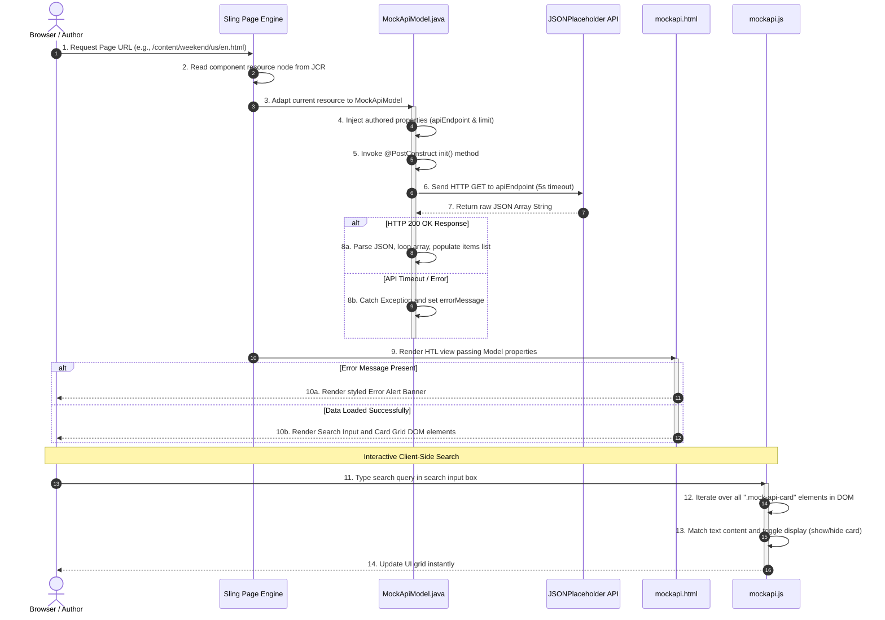

# API-Based Data Rendering (Mock API) Component Guide

This guide provides a comprehensive overview of the **Mock API Data Component** in the AEM Weekend Project. It details the technologies used, the execution flow between files, the source of the data, and an analysis of alternative design approaches.

---

## 1. Technologies & Architecture: What we used, why, and how

To build this component, we integrated several AEM and standard Java mechanisms:

### A. Sling Model (Java Backend)
*   **What it is**: A standard AEM framework that adapts JCR resources (content nodes) directly to Java classes.
*   **Why we use it**: It acts as the "controller" in MVC. It reads dialog properties, handles API integration, parses raw payloads, and serves formatted data directly to HTL.
*   **How we use it**: Created [MockApiModel.java](file:///c:/Users/Project1/weekend/core/src/main/java/com/weekend/core/models/MockApiModel.java). Annotations like `@Model` register the class, and `@ValueMapValue` injects values authored in the JCR (endpoint URL and limit).

### B. Java HTTP Client (JDK 11)
*   **What it is**: The standard HTTP client introduced in Java 11 (`java.net.http.HttpClient`).
*   **Why we use it**: It is lightweight, native, and supports modern features like asynchronous calls and timeouts without importing heavy third-party libraries (e.g. Apache HttpClient).
*   **How we use it**: Instantiated via `HttpClient.newBuilder()` with a strict 5-second connection timeout, executing a GET request synchronously on page load.

### C. Jackson Object Mapper (JSON Parser)
*   **What it is**: A high-performance Java library (`com.fasterxml.jackson.databind.ObjectMapper`) used to map JSON structures to Java objects.
*   **Why we use it**: The external API sends data as a raw string. Jackson translates this string into a traversable `JsonNode` tree, allowing us to map fields dynamically.
*   **How we use it**: Parsed using `mapper.readTree(response.body())`, loop through the array node, extract profile fields (including nested objects like `company.name`), and instantiate `MockUserItem` items.

### D. HTML Template Language - HTL / Sightly (Frontend Rendering)
*   **What it is**: AEM's secure HTML templating language.
*   **Why we use it**: It provides automatic XSS protection, clean separation of concerns, and binds backend Java objects dynamically.
*   **How we use it**: In [mockapi.html](file:///c:/Users/Project1/weekend/ui.apps/src/main/content/jcr_root/apps/weekend/components/mockapi/mockapi.html), we use `data-sly-use.model` to load the Sling Model. We then use a tagless `<sly data-sly-list.item="${model.items}">` to repeat user card blocks.

### E. AEM Clientlibs (CSS & JS)
*   **What it is**: AEM's mechanism to package, minify, and serve CSS and JS files.
*   **Why we use it**: It aggregates CSS and JS files automatically, delivering them efficiently to the browser.
*   **How we use it**: Configured under `weekend.components.mockapi`. [mockapi.css](file:///c:/Users/Project1/weekend/ui.apps/src/main/content/jcr_root/apps/weekend/components/mockapi/clientlibs/css/mockapi.css) styles the card layouts, and [mockapi.js](file:///c:/Users/Project1/weekend/ui.apps/src/main/content/jcr_root/apps/weekend/components/mockapi/clientlibs/js/mockapi.js) binds input event listeners to filter cards.

---

## 2. Project Execution Flow: How files interact

Here is the visual sequence diagram of the flow (available as an image in your project root at [mockapi_flow_diagram.png](file:///c:/Users/Project1/weekend/mockapi_flow_diagram.png)):


### Mermaid Text-Based Diagram:


---

## 3. The Data: What it is and where it comes from

### A. The Data Source
We are fetching mock user profile directory data from a public REST service:
*   **Target Endpoint**: `https://jsonplaceholder.typicode.com/users`
*   **Who Created It**: We did **not** create this data. It is served by **JSONPlaceholder**, a free online REST API service used for frontend testing and prototyping.

### B. Example Payload Structure
The API returns a JSON array. Below is the structure of a single user object we fetch:
```json
[
  {
    "id": 1,
    "name": "Leanne Graham",
    "username": "Bret",
    "email": "Sincere@april.biz",
    "phone": "1-770-736-8031 x56442",
    "website": "hildegard.org",
    "company": {
      "name": "Romaguera-Crona",
      "catchPhrase": "Multi-layered client-server neural-net",
      "bs": "harness real-time e-markets"
    }
  }
]
```
Our Java backend maps this raw payload into a simple model (`MockUserItem`) representing:
*   `name` ➔ Rendered in title
*   `initials` ➔ Dynamically derived (e.g. "L" from "Leanne") for the avatar bubble
*   `company` ➔ Fetched from nested object `company.name`
*   `email` ➔ Rendered as a `mailto:` link
*   `phone` ➔ Formatted text field
*   `website` ➔ Rendered as a external clickable link

---

## 4. Alternative Approaches and Why This Method is Best

There are multiple ways to retrieve and render external data in AEM. Here is the visual diagram comparing the two main architectural patterns we used (available as an image in your project root at [flows_comparison.png](file:///c:/Users/Project1/weekend/flows_comparison.png)):


Here is how they compare:

| Approach | How it works | Pros | Cons |
| :--- | :--- | :--- | :--- |
| **Server-Side Sling Model adaptation** *(Our Approach)* | The Sling Model queries the API during page build, parses JSON, and renders completed HTML. | **1. SEO Friendly**: Content is crawled instantly.<br>**2. Secure**: API keys are hidden in Java.<br>**3. No CORS**: Server bypasses browser security blocks. | Page rendering speed depends on the external API response time (mitigated via timeouts). |
| **Client-Side AJAX (Fetch / jQuery)** | The HTML loads empty. JavaScript runs in the browser, calls the endpoint, and renders cards dynamically. | 1. Fast initial page paint.<br>2. Offloads rendering work from the AEM server. | **1. Poor SEO**: Crawlers see an empty component.<br>**2. Security Risks**: Exposes credentials in DevTools.<br>**3. CORS Blocks**: Browser blocks cross-site requests. |
| **Sling Servlet Proxy** | Browser JS calls a local AEM Servlet (e.g., `/bin/fetchUsers`), which makes the backend request to the API. | 1. Hides API credentials.<br>2. Resolves CORS issues. | Still requires JS rendering, poor SEO, double network routing. |
| **AEM Sync Service (Content Fragments)** | A background OSGi job periodically fetches API data and saves it in the JCR as AEM Content Fragments. | 1. Extremely fast page rendering.<br>2. Content authors can modify or translate records locally. | High complexity, sync latency (not real-time data), JCR storage overhead. |

### Why We Selected Our Approach
We chose **Server-Side Sling Model adaptation** because it offers the perfect balance of **excellent SEO performance**, **strong security** (keys remain hidden in AEM), **simplicity of implementation**, and **resiliency** (with built-in connection timeouts).

---

## 5. Memory Flow: Where is the data stored?

Here is a visual representation of how the REST API data is handled strictly in JVM temporary memory (RAM) and **never** written to the JCR database:


### Key Memory Lifecycle Concepts:
1. **Permanent (JCR)**: Only the text strings for the `apiEndpoint` URL and `limit` are saved in the JCR database.
2. **Temporary (RAM)**: The JSON string returned by the API server is loaded into the AEM server's Java Virtual Machine (JVM) RAM, mapped to objects, rendered to HTML, and sent to the browser.
3. **Clean-up**: Once the HTTP response is completed, the Java memory objects are automatically garbage-collected, ensuring zero database bloat.
