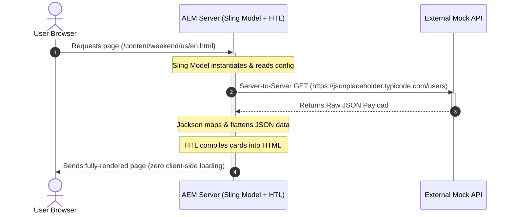
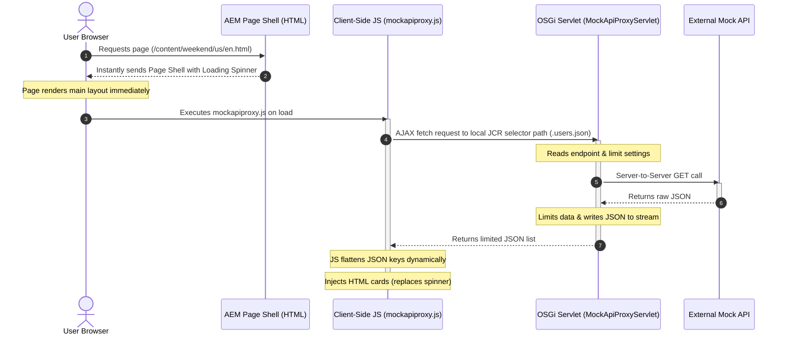
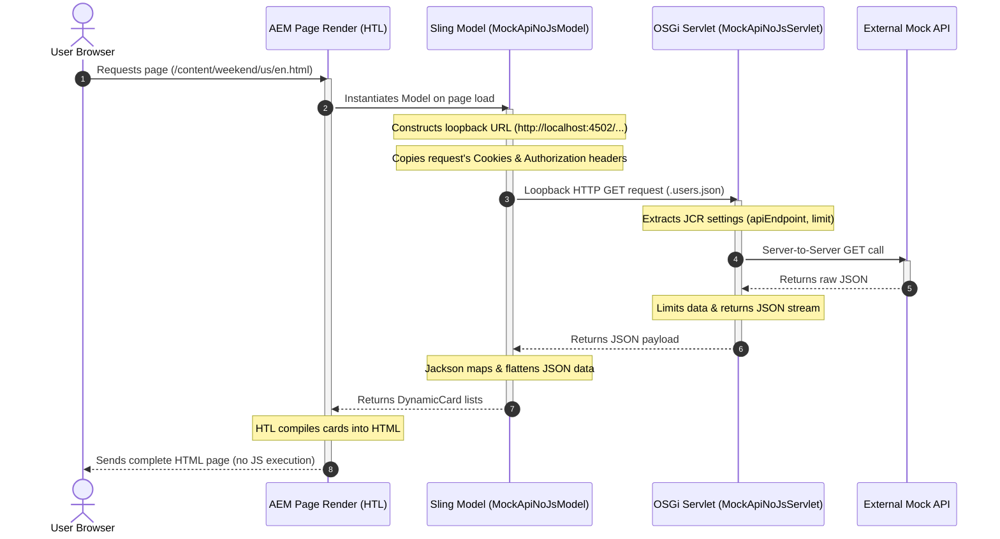

# AEM Mock Integration Components - Workflow Guide

This guide explains the architecture, request flows, and key differences between the three mock API integration components developed in the Weekend Project:
1. **Mock API Direct Component** (`mockapi`)
2. **Mock API Servlet Proxy Component** (`mockapiproxy`)
3. **Mock API Server-Side Loopback Component** (`mockapinojs`)

---

## 1. Architectural Workflow Comparison

Below is the visual overview comparing the request flow and rendering cycles of all three integration patterns:

---

## 2. Component 1: Mock API Direct (`mockapi`)

### Description
This component performs a **Direct Server-to-Server** HTTP request. When AEM receives the page request, the Sling Model executes, queries the third-party REST API directly, flattens the JSON response, and maps it to Java objects. HTL loops through this data to render HTML before the page is delivered to the browser.

### Sequence Diagram

---

## 3. Component 2: Mock API Servlet Proxy (`mockapiproxy`)

### Description
This component uses **Client-Side Rendering (Asynchronous)**. AEM immediately serves the page HTML containing a loading spinner. Once loaded, client-side JavaScript sends an AJAX `fetch()` request to a local OSGi Servlet endpoint (`/content/.../mockapiproxy.users.json`). The servlet requests the external API, applies JCR limit configurations, and returns JSON. The browser JS then parses the JSON and builds the card DOM structure dynamically.

### Sequence Diagram

---

## 4. Component 3: Mock API Server-Side Loopback (`mockapinojs`)

### Description
This component operates **Server-Side with No JavaScript** but routes the integration through a backend **Sling Servlet**. During page compilation, the Sling Model is instantiated. Instead of calling the API directly, it performs a local loopback HTTP call internally to its associated OSGi Servlet. The servlet fetches the mock API data, applies JCR limits, and writes it out as JSON. The Sling Model captures this JSON response, flattens it, and exposes it to HTL for server-side HTML rendering.

### Sequence Diagram

---

## 5. Logical & Performance Comparison Matrix

| Criteria | **Direct Component (`mockapi`)** | **Servlet Proxy Component (`mockapiproxy`)** | **Loopback Component (`mockapinojs`)** |
| :--- | :--- | :--- | :--- |
| **Rendering** | Server-Side (Java/HTL) | Client-Side (Browser JS) | Server-Side (Java/HTL) |
| **JS Required?** | **No** (Optional search box filter only) | **Yes** (Required for fetch & DOM injection) | **No** (Zero client-side JS executing) |
| **Performance Impact** | Blocks page rendering until external API responds. | Instant page load; visual cards load asynchronously. | Blocks page rendering; adds overhead of internal HTTP request. |
| **Authentication** | None needed for client. | Handled automatically by AEM resource access. | Relies on Model copying Authorization headers to Loopback. |
| **Use Case** | Search directories or SEO-heavy widgets that must load on step one. | Dashboard panels, slow/third-party widgets, non-SEO data grids. | Legacy environments requiring strict no-JS execution combined with servlet reuse. |
