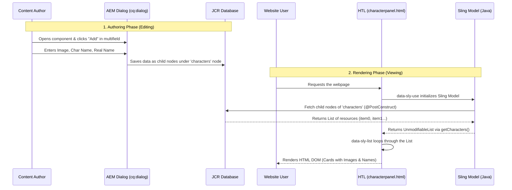
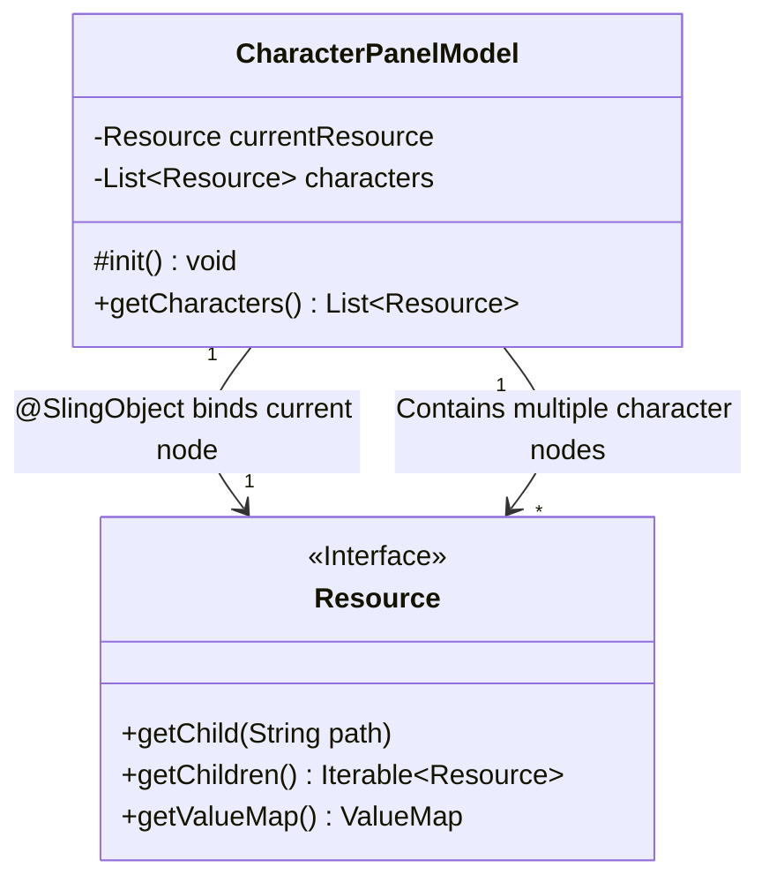

# Character Panel Component - Logical Architecture & Flow

Vanakkam! Intha document-la "Character Panel" component oda complete logical architecture, real-time scenarios, and data flow epdi aaguthu nu innum detailed-ah (in Tanglish) paapom.

## 1. Introduction: What is the Character Panel?
Intha component oru website page-la multiple characters-a (eg. Actors, superheroes) card format-la display panna use aaguthu. 
Ithu oru **"Multifield"** component. Athavathu, author oru fixed number of fields illama, 'n' number of items add pannite pogalam. 

AEM-la oru perfect component create panna 4 major files thevai:
1. **Component Node (`.content.xml`)**: Component identity (Name, Group).
2. **Dialog (`_cq_dialog/.content.xml`)**: Author input kudukkura UI Form.
3. **Sling Model (`CharacterPanelModel.java`)**: JCR (Database) la irunthu data-va eduthu frontend-ku kodukkura Java Backend.
4. **HTL Script (`characterpanel.html`)**: Data-va vachu HTML UI create pandra Frontend View.

---

## 2. Real-Time Scenario (Step-by-Step Flow)

### Phase 1: Authoring (Data Input)
1. Content Author oru AEM page-a 'Edit' mode-la open pandranga.
2. "Character Panel" component-a page-la drag panni drop pandranga.
3. Configure icon (Wrench 🔧) click panna, **Dialog** open aagum.
4. "Add" button click panni 3 characters add pandranga. Ovvoru character-kum:
   - Image Path (`fileReference`)
   - Character Name (`characterName`)
   - Real Name (`realName`)
5. Data enter panni 'Done' (Tick ✔️) click panna odane, AEM intha data-va backend-la JCR repository-la (database) save pannidum.
   - Eppadi save aagum? `.../jcr:content/root/characterpanel/characters/item0`, `item1`, `item2` nu child nodes-ah save aagum.

### Phase 2: Rendering (Data Display)
1. Oru user website-a open panni intha page-a paakuraanga.
2. Server-la `characterpanel.html` (HTL) file execute aagum.
3. HTL odane Sling Model (`CharacterPanelModel.java`) kitta "Enaku data kudu" nu kekum.
4. Sling Model JCR-la irunthu `item0`, `item1`, `item2` nodes-a read panni, athai oru Java `List`-ah convert panni HTL-ku thiruppi anuppum.
5. HTL antha `List`-a loop panni, 3 HTML Cards-a generate panni screen-la kaatum.

---

## 3. Architecture Diagrams

### A. Data Flow Diagram
Oru user page-a paakum pothu data eppadi flow aaguthu nu intha flowchart clear-ah kaatum.



### B. UML Class Diagram (Backend Concept)
Sling Model eppadi JCR Resource kooda interact pannuthu nu kaatura technical UML idhu.



---

## 4. Deep Dive: Code Logic Epdi Work Aaguthu?

Intha section-la namma eluthuna code lines eppadi logically work aaguthu nu paapom.

### 1. The Sling Model (`CharacterPanelModel.java`)
Ithu thaan component oda "Brain".

* **`@Model(adaptables = Resource.class)`**: Ithu oru AEM specific annotation. Ithu AEM kitta sollum, "Naan oru Sling Model. Ennaku input-ah component oda node-a (Resource) kudu" nu.
* **`@SlingObject Resource currentResource;`**: Ithu oru injection annotation. Component page-la drop panna edathula ulla AEM Node-a (path-a), intha `currentResource` variable-la auto-map pannidum.
* **`@PostConstruct protected void init()`**: Intha class load aana udane, default-ah first intha method thaan trigger aagum. Inga thaan namma main extraction logic irukku:
  ```java
  // 'characters' nu author create panna parent node-a edukkurom
  Resource charactersNode = currentResource.getChild("characters"); 
  
  if (charactersNode != null) {
      // Athu kela irukka item0, item1 elathayum loop pandrom
      for (Resource child : charactersNode.getChildren()) {
          // Ovvoru item-ayum Java List-la add pandrom
          characters.add(child); 
      }
  }
  ```
* **`public List<Resource> getCharacters()`**: Ithu oru Getter method. HTL-la irunthu call pannum pothu, HTL-ku namma prepare panna list-a ithu thaan return pannuthu. `Collections.unmodifiableList()` use panni data-va secure aaha pass pandrom.

### 2. The Frontend HTL (`characterpanel.html`)
Ithu component oda "Face".

* **`data-sly-use.model="com.weekend.core.models.CharacterPanelModel"`**: HTL file-a, mela irukka Java code kooda link pandra line ithu thaan. Ippo antha class-a `model` ngra peyarla call pannikalam.
* **`data-sly-test="${model.characters}"`**: Oru safety check. Author aachum oru character add panni iruntha mattum thaan, HTML div render aagum. Illana blank aaha irukkum (Errors thadukka ithu best practice).
* **`data-sly-list.item="${model.characters}"`**: Intha line, Java namakku kudutha List-a `for-loop` madhiri loop pannum. Loop aagura ovvoru single element-um `item` nu kedaikkum.
* **`${item.valueMap.fileReference}` & `${item.valueMap.characterName}`**: JCR node-la irukka data-va ippadi thaan dot(`.`) vachu extract pandrom.
  * `@ context='uri'`: Image path URL aaha irukku nu browser-ku solli, XSS attacks-a thadukkum.
  * `@ context='html'`: Text content-a safe aaha render pannum.

### 5. Summary & Best Practices
Intha `CharacterPanel` component AEM oda **MVC (Model-View-Controller)** pattern-a strictly follow pannuthu:
* **Model**: JCR Database (Nodes & Properties).
* **Controller**: Sling Model (`CharacterPanelModel.java`) - Data extraction and logic.
* **View**: HTL (`characterpanel.html`) - UI Rendering.

Ippadi Business Logic (Java) and UI Logic (HTL) aaha pirichi panrathu thaan AEM-la scalable and maintainable project architecture!
