# Comprehensive AEM Master Documentation
This document contains the complete collection of all architectural analyses, UML diagrams, flow charts, and concepts generated throughout our historical chats.


---

## Source: model.md

# Character Panel Model Explanation

## `ArrayList` Yethuku use pandrom?

`CharacterPanelModel.java` la line 23 la `characters = new ArrayList<>();` nu koduthurkom. Ithu yethukku na:

1. **Dynamic Size (Ennamika theriyathu):** AEM author dialog-la yethana characters vena add pannalam (multifield-la). Atha munnadiye exact-ah number solla mudiyathu (fixed size Array maari). So, eppo vena items add pandra mathiri `ArrayList` use pandrom.
2. **Insertion Order (Vurisaiya irukka):** Author entha order-la dialog-la items add pandrangalo, athe order-la thaan UI-layum display aaganum. `ArrayList` namma add pandra order-ai sariya maintain pannum.
3. **List Interface Implementation:** `List` ngurathu Java-la oru interface. Athai direct-ah object-ah create panna mudiyathu. Athoda best implementation thaan `ArrayList`. So, object create panna `new ArrayList<>()` use pandrom.

## Code Flow - UML Sequence Diagram

Keela irukka diagram intha Model eppadi execute aaguthu nguratha theliva kaattuthu.

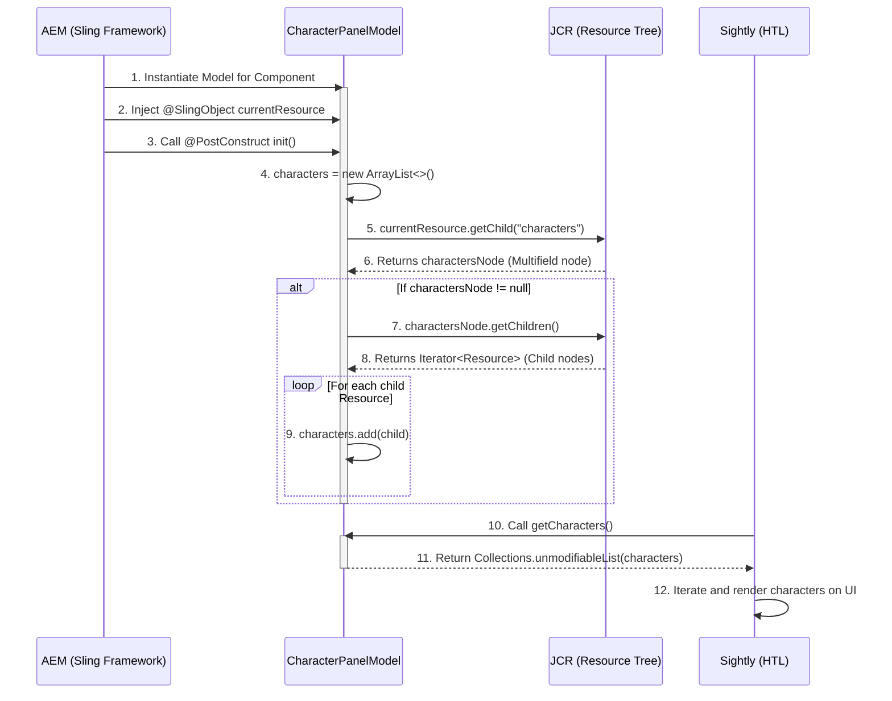

## Flow Explanation (Tanglish)

1. **Model Instantiation:** AEM eppo unga component-ai page-la load pannutho, appo intha `CharacterPanelModel`-ai create pannum.
2. **Injection:** `@SlingObject` annotation irukurathunala, component-oda JCR node-ai (Resource) `currentResource` variable-la AEM inject pannidum.
3. **Initialization:** Model object create aana udane, `@PostConstruct` annotation vacha `init()` method automatic-ah call aagum.
4. **ArrayList Creation:** `init()` method kulla, `characters` list-ku oru pudhusah memory allocate panni `ArrayList` object create aaguthu.
5. **Fetch Node:** `currentResource.getChild("characters")` moolama, component node-kulla author add panna `characters` (multifield) node-ai JCR-la irunthu edukurom.
6. **Null Check & Loop:** Antha `charactersNode` empty-ah (null) illanu check pannitu, athukulla irukka ovvoru child node-ayum (`getChildren()`) loop pandrom.
7. **Add to List:** Loop aagura ovvoru child node-ayum (Resource) namma create panna antha pudhu `ArrayList`-la (`characters.add(child)`) serthu vachukurom.
8. **Getter for HTL:** Kadaisiya, HTL (Sightly) unga HTML UI-ai render pannum pothu, model-oda `getCharacters()` method-ai call pannum. Appo namma read-only (unmodifiableList) ah antha `characters` list-ai anuppidurom. HTL atha loop panni page-la content-ai display pannidum.

## Data Types Comparison: Why not others?

AEM multifield-ku `ArrayList` thaan perfect fit. Matha data types yethuku set aagathu nu keela compare panni papom:

| Data Type | Property | Why we didn't use it? (Tanglish) |
| :--- | :--- | :--- |
| **`Array` (`Resource[]`)** | Fixed Size | Array-oda size fixed. Munnadiye "10 characters thaan varum" nu sonna mattum thaan use panna mudiyum. Author yethana add pannuvangane theriyathu, so ithu work aagathu. |
| **`LinkedList`** | Dynamic, Fast Insertion | Naduvula elements add/remove panna fast-ah irukum. Aana namma HTL-la read (iterate) thaan panna porom. Read pandrathuku `ArrayList` thaan fast and memory efficient. |
| **`Set` (`HashSet`)** | No Duplicates, Unordered | HashSet order-ai maintain pannathu. Author "Iron Man" first, "Thor" second nu add panna, UI-la antha vurisai maari display aagidum. Author kudutha order mukkiyam! |
| **`Map` (`HashMap`)** | Key-Value Pair | Key-Value pair-ah data store pannum (e.g., "id1" -> "Iron Man"). Namma multifield-la oru list of items thaan venum, specific key theva illa. Ithu simple list-ku over-engineering. |


---

## Source: weekend_project_documentation.md

# Weekend AEM Project — Complete Technical Documentation

> **For new developers:** This document is a complete reference to understand the **Weekend AEM Project** from scratch — its architecture, module structure, components, clientlibs, and how everything connects.

---

## 1. Project Identity

| Property | Value |
|---|---|
| **Project Name** | Weekend Project |
| **GroupId** | `com.weekend` |
| **ArtifactId** | `weekend` |
| **Version** | `1.0.0-SNAPSHOT` |
| **AEM Version** | Cloud (AEM as a Cloud Service) |
| **Base Package** | `com.weekend` |
| **App ID** | `weekend` |
| **Build Tool** | Maven |
| **Frontend** | Webpack + TypeScript (general frontend module) |
| **Generated From** | AEM Project Archetype |

---

## 2. High-Level Architecture

```mermaid
graph TD
    A[Developer] -->|mvn clean install| B[Maven Build]
    B --> C[all/]
    C -->|CRX Package| D[AEM Cloud Instance]
    D --> E[JCR Repository]

    subgraph Maven Modules
        M1[core/ — Java OSGi Bundle]
        M2[ui.apps/ — Components & Clientlibs]
        M3[ui.content/ — Sample Content]
        M4[ui.frontend/ — Webpack/TypeScript]
        M5[ui.config/ — OSGi Configs]
        M6[ui.apps.structure/ — Package Structure]
        M7[dispatcher/ — CDN/Cache Config]
        M8[it.tests/ — Integration Tests]
        M9[ui.tests/ — Selenium UI Tests]
    end

    B --> M1
    B --> M2
    B --> M3
    B --> M4
```

---

## 3. Maven Module Breakdown

```
weekend/                          ← Root project (parent pom.xml)
 ├── core/                        ← Java OSGi bundle (Sling Models, Servlets, etc.)
 ├── ui.apps/                     ← AEM Components, Clientlibs, Templates
 ├── ui.apps.structure/           ← Repository package structure definition
 ├── ui.content/                  ← Sample/initial page content
 ├── ui.frontend/                 ← Webpack build (TypeScript/CSS source)
 ├── ui.config/                   ← OSGi run-mode configurations
 ├── all/                         ← Master package (embeds all sub-packages)
 ├── dispatcher/                  ← Apache/CDN dispatcher config
 ├── it.tests/                    ← Java integration tests
 └── ui.tests/                    ← Selenium UI tests
```

---

## 4. Detailed Folder Structure — `ui.apps`

This is the most important module — it contains all AEM components and clientlibs.

```
ui.apps/
└── src/main/content/jcr_root/apps/weekend/
     ├── components/              ← All AEM Components (33 total)
     │    ├── page/               ← Page component (inherits core WCM page v3)
     │    ├── helloworld/         ← Custom hello world component
     │    ├── card/               ← Custom card component
     │    ├── characterpanel/     ← Custom character panel component ⭐
     │    ├── myimage/            ← Custom image proxy (extends core image v3)
     │    ├── image/              ← Image proxy component
     │    ├── accordion/          ← Proxy: core accordion
     │    ├── breadcrumb/         ← Proxy: core breadcrumb
     │    ├── button/             ← Proxy: core button
     │    ├── carousel/           ← Proxy: core carousel
     │    ├── container/          ← Proxy: core container
     │    ├── contentfragment/    ← Proxy: core content fragment
     │    ├── download/           ← Proxy: core download
     │    ├── embed/              ← Proxy: core embed
     │    ├── form/               ← Proxy: core form
     │    ├── list/               ← Proxy: core list
     │    ├── navigation/         ← Proxy: core navigation
     │    ├── search/             ← Proxy: core search
     │    ├── tabs/               ← Proxy: core tabs
     │    ├── teaser/             ← Proxy: core teaser
     │    ├── text/               ← Proxy: core text
     │    ├── title/              ← Proxy: core title
     │    └── ...                 ← (more proxy components)
     │
     └── clientlibs/             ← Global Client Libraries (5 total)
          ├── clientlib-base/     ← category: weekend.base (embeds core components)
          ├── clientlib-site/     ← category: weekend.site
          ├── clientlib-dependencies/ ← category: weekend.dependencies
          ├── clientlib-grid/     ← category: weekend.grid
          └── clientlibs-sample-dependency/ ← category: weekend.sample_dep ⭐
```

---

## 5. Component Architecture — Proxy vs Custom

```mermaid
graph TD
    subgraph "AEM Core WCM Components (Adobe)"
        CORE_IMG["core/wcm/components/image/v3/image"]
        CORE_PAGE["core/wcm/components/page/v3/page"]
        CORE_ACCORDION["core/wcm/components/accordion/v1"]
        CORE_BREADCRUMB["core/wcm/components/breadcrumb/v2"]
    end

    subgraph "Weekend Project — Proxy Components"
        MYIMAGE["myimage\n(extends image/v3)"]
        IMAGE["image\n(extends image/v3)"]
        PAGE["page\n(extends page/v3)"]
        ACCORDION["accordion\n(extends accordion/v1)"]
        BREADCRUMB["breadcrumb\n(extends breadcrumb/v2)"]
    end

    subgraph "Weekend Project — Custom Components"
        CARD["card\n(fully custom)"]
        HELLO["helloworld\n(fully custom)"]
        CHARPANEL["characterpanel\n(fully custom) ⭐"]
    end

    CORE_IMG --> MYIMAGE
    CORE_IMG --> IMAGE
    CORE_PAGE --> PAGE
    CORE_ACCORDION --> ACCORDION
    CORE_BREADCRUMB --> BREADCRUMB
```

> **Proxy Component** = inherits everything from AEM Core. Only overrides what's needed.
> **Custom Component** = built from scratch with its own dialog, HTML, and clientlibs.

---

## 6. Custom Components — Deep Dive

### 6.1 `card` Component

**Location:** `components/card/`

**Purpose:** Displays a title and text area authored via dialog.

**Files:**
```
card/
 ├── .content.xml          ← Registers component, group: "Weekend Components"
 ├── card.html             ← HTL template
 └── _cq_dialog/
      └── .content.xml     ← Author dialog (title + textarea fields)
```

**card.html:**
```html
<h1>${properties.title}</h1>
<h4>${properties.textarea}</h4>

<sly data-sly-use.clientLib="/libs/granite/sightly/templates/clientlib.html"></sly>
<sly data-sly-call="${clientLib.css @ categories='weekend.sample_dep'}" />
<sly data-sly-call="${clientLib.js  @ categories='weekend.sample_dep'}" />
```

**Clientlib used:** `weekend.sample_dep` (from `clientlibs-sample-dependency/`)

**Data Flow:**
```
Author edits dialog
  └── saves: properties.title, properties.textarea
         ↓
card.html renders
  ├── <h1> = title value
  └── <h4> = textarea value
```

---

### 6.2 `helloworld` Component

**Location:** `components/helloworld/`

**Purpose:** A simple demo component (archetype-generated).

**Files:**
```
helloworld/
 ├── .content.xml
 ├── helloworld.html
 └── _cq_dialog/
      └── .content.xml
```

---

### 6.3 `characterpanel` Component ⭐ (Most Complex Custom Component)

**Location:** `components/characterpanel/`

**Purpose:** Displays a horizontal panel of character cards. Each card shows an image, character name, and real name. Supports multiple entries via a multifield dialog.

**Files:**
```
characterpanel/
 ├── .content.xml                   ← Component definition
 ├── characterpanel.html            ← HTL template
 ├── _cq_dialog/
 │    └── .content.xml             ← Multifield dialog
 └── clientlibs/
      ├── .content.xml             ← category: weekend.characterpanel
      ├── css.txt                  ← #base=css, style.css
      ├── js.txt                   ← #base=js, characterpanel.js
      ├── css/
      │    └── style.css           ← Card layout CSS
      └── characterpanel.js        ← Hover animation JS
```

**characterpanel.html:**
```html
<sly data-sly-use.clientlib="/libs/granite/sightly/templates/clientlib.html">
    <sly data-sly-call="${clientlib.css @ categories='weekend.characterpanel'}"/>
    <sly data-sly-call="${clientlib.js  @ categories='weekend.characterpanel'}"/>
</sly>

<div class="character-panel">
    <div data-sly-list.item="${resource.getChild('characters').getChildren}">
        <div class="character-card">
            
            <h3>${item.properties.characterName @ context='html'}</h3>
            <p>${item.properties.realName @ context='html'}</p>
        </div>
    </div>
</div>
```

**Dialog Data Flow:**
```
Author opens dialog
  └── Multifield (composite=true) → each entry saved as child node under "characters"
       ├── item0/
       │    ├── fileReference = /content/dam/hero.jpg
       │    ├── characterName = "Iron Man"
       │    └── realName      = "Tony Stark"
       └── item1/ ...
              ↓
characterpanel.html
  └── resource.getChild('characters').getChildren → loops item0, item1...
       └── renders character-card for each
```

**Clientlib Flow:**
```
weekend.characterpanel
  ├── CSS → css/style.css   (flex layout, card sizing)
  └── JS  → characterpanel.js  (DOMContentLoaded + hover scale effect)
```

---

### 6.4 `myimage` Component

**Location:** `components/myimage/`

**Purpose:** Custom image proxy that extends `core/wcm/components/image/v3/image`. Uses `fileReference` property for DAM-picked images.

```html
<!-- myimage.html -->
<div>
    
</div>
```

---

## 7. Clientlib Architecture

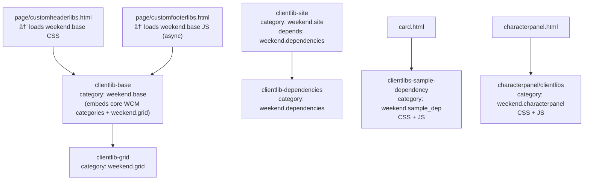

### Clientlib Category Summary

| Clientlib Folder | Category | CSS | JS | Used By |
|---|---|---|---|---|
| `clientlib-base` | `weekend.base` | ✅ (embeds) | ✅ (embeds) | `page/customheaderlibs.html` |
| `clientlib-site` | `weekend.site` | ✅ | ✅ | Frontend webpack output |
| `clientlib-dependencies` | `weekend.dependencies` | ✅ | ✅ | `clientlib-site` depends on it |
| `clientlib-grid` | `weekend.grid` | ✅ | ✅ | Embedded in `weekend.base` |
| `clientlibs-sample-dependency` | `weekend.sample_dep` | ✅ | ✅ | `card.html` |
| `characterpanel/clientlibs` | `weekend.characterpanel` | ✅ | ✅ | `characterpanel.html` |

---

## 8. Page Component & Global Clientlib Loading

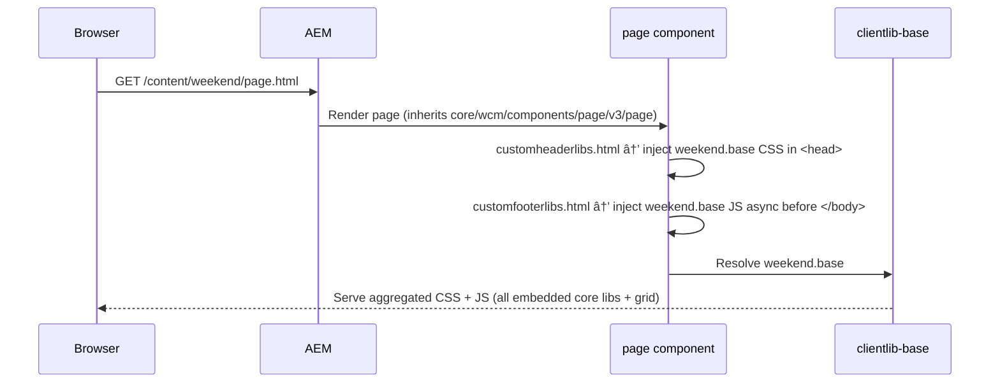

---

## 9. Core Java Module — `core/`

**Package:** `com.weekend.core`

**Sub-packages (standard AEM archetype structure):**
```
core/src/main/java/com/weekend/core/
 ├── filters/       ← Sling request/response filters
 ├── listeners/     ← JCR event listeners
 ├── models/        ← Sling Models (@Model annotated Java classes)
 ├── schedulers/    ← OSGi scheduled jobs
 └── servlets/      ← Sling Servlets
```

> ⚙️ **Note:** The `core` module is compiled into an OSGi bundle and deployed to AEM. Sling Models here back HTL components using `data-sly-use`.

---

## 10. Frontend Module — `ui.frontend/`

**Technology Stack:**

| Tool | Purpose |
|---|---|
| Webpack | Bundles JS and CSS |
| TypeScript | Typed JavaScript source |
| Babel | JS transpilation |
| ESLint | Code linting |
| `clientlib.config.js` | Maps Webpack output → AEM clientlibs |

**Build Flow:**
```
ui.frontend/src/ (TypeScript/SCSS)
       ↓ webpack build
ui.frontend/dist/
       ↓ clientlib.config.js maps output
ui.apps/clientlibs/clientlib-site/   (CSS + JS written here)
       ↓ Maven install
AEM Instance
```

---

## 11. Component Group Summary

| Group Name | Components |
|---|---|
| `Weekend Components` | `card`, `characterpanel` |
| `Weekend Project - Content` | `helloworld`, `myimage`, `image`, `button`, `text`, etc. |
| `.hidden` | `page` (not shown in author component picker) |

---

## 12. Full Data Flow — End to End

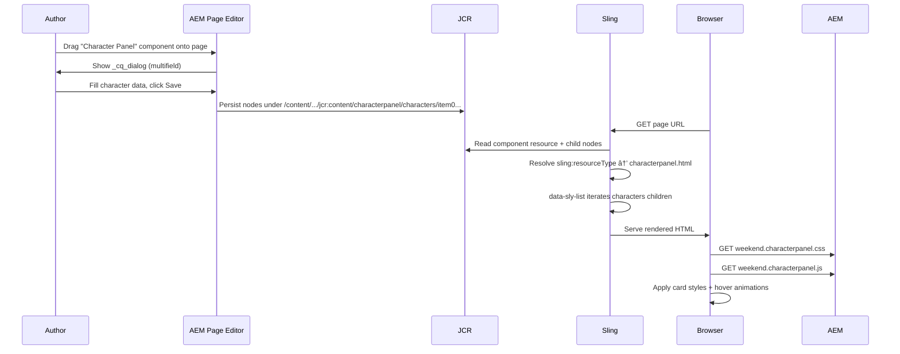

---

## 13. Bug History & Fixes Applied

### `card.html` — Fixed Bugs

| Bug | Original | Fixed |
|---|---|---|
| Wrong sightly path | `/libs/granite/slightyly/templetes/clientlib.html` | `/libs/granite/sightly/templates/clientlib.html` |
| Wrong category name | `weekend.samples-dep` | `weekend.sample_dep` |
| Missing JS load | Only CSS loaded | Added `clientLib.js` call |

### `characterpanel` — Fixed Bugs

| # | Bug | Status |
|---|---|---|
| 1 | `css.txt` missing `#base=css` | ✅ Fixed |
| 2 | HTML iterated wrong nodes (`resource.getChildren`) | ✅ Fixed → `resource.getChild('characters').getChildren` |
| 3 | Missing XSS context on img/text | ✅ Fixed → added `@ context='uri'/'html'` |
| 4 | JS clientlib never loaded | ✅ Fixed → added `js.txt` + `characterpanel.js` |
| 5 | Dialog used `./image` instead of `./fileReference` | ✅ Fixed |
| 6 | `style.css` not in `css/` subfolder | ✅ Fixed → moved to `clientlibs/css/style.css` |

---

## 14. How to Build & Deploy

```powershell
# 1. Start AEM Quickstart JAR (author instance)
java -jar aem-author-p4502.jar

# 2. Build and deploy entire project
cd c:\Users\Project1\weekend
mvn clean install -PautoInstallPackage

# 3. Verify in CRXDE
# http://localhost:4502/crx/de → apps/weekend/

# 4. Verify clientlibs
# http://localhost:4502/libs/granite/ui/content/dumplibs.html

# 5. Open AEM Sites
# http://localhost:4502/sites.html
```

---

## 15. Quick Reference — Key Paths

| What | Path |
|---|---|
| All components | `ui.apps/src/main/content/jcr_root/apps/weekend/components/` |
| All global clientlibs | `ui.apps/src/main/content/jcr_root/apps/weekend/clientlibs/` |
| Page header (CSS injection) | `components/page/customheaderlibs.html` |
| Page footer (JS injection) | `components/page/customfooterlibs.html` |
| Java Sling Models | `core/src/main/java/com/weekend/core/models/` |
| Archetype config | `archetype.properties` |
| Root POM | `pom.xml` |


---

## Source: aem_project_structure.md

# AEM Project Structure Analysis & Explanation

Vanakkam! Intha project folder oru standard **AEM (Adobe Experience Manager) Maven Project** structure-a follow pannuthu. Ithu AEM Project Archetype use panni generate panna project. 

Intha folder-la irukka ovvoru subfolder-um (modules) oru specific purpose-kaga create pannapatrukku. Athoda details-a inga detail-a pakalam.

## Subfolders (Modules) Explanation

### 1. `core` (The Brain)
Ithu namma project-oda backend logic. Java code ellam inga dhan irukkum. 
- **What it does:** OSGi services, Sling Models, Servlets, Schedulers, and Listeners ellam inga thaan eluthuvom.
- **How it works:** Intha code compile aagi oru `.jar` (OSGi bundle) file-a create aagum. Ithu AEM-la install aagi namma components-kku thevaiyaana data-va provide pannum.

### 2. `ui.apps` (The Frontend & Structure)
Ithu namma project-oda UI logic matrum components irukka edam.
- **What it does:** Components (HTL/HTML files), dialogs (authoring configure panna), CSS, JavaScript (clientlibs) ellam inga irukkum.
- **How it works:** Ithu compile aagi oru `.zip` package-a maarum. AEM-la `/apps` folder ulla namma project name-la deploy aagum.

### 3. `ui.content` (The Sample Content)
Ithu namma create panna components-a use panni uruvakkapatta sample pages, templates, and assets irukka edam.
- **What it does:** Initial site structure, sample pages, policies, editable templates ellam inga thaan maintain pannuvom.
- **How it works:** Ithu AEM-oda `/content` and `/conf` folder-la deploy aagum. Authors ithai use panni page create pannuvanga.

### 4. `ui.config` (The Configurations)
AEM-kku thevaiyaana OSGi configurations ellam inga irukkum.
- **What it does:** Runmode-specific configurations (e.g., `author`, `publish`, `dev`, `prod`) inga maintain pannuvom.
- **How it works:** AEM instance start aagumpothu, intha configs-a read panni atha padi services-a behave panna vaikum.

### 5. `ui.frontend` (The Frontend Build Mechanism)
Ithu oru dedicated modern frontend build setup (like Webpack, React, Angular).
- **What it does:** Pure frontend developers inga SCSS, TypeScript/JS code eluthuvanga. 
- **How it works:** Maven build run aagumpothu, inga irukka frontend code compile aagi (minified & bundled), athoda output `ui.apps` folder-la irukka clientlibs-kku automatically copy aagum.

### 6. `dispatcher` (Caching & Security)
Ithu namma web server (Apache/IIS) configs irukka edam.
- **What it does:** Dispatcher cache rules, farm files, vhost configurations, URL rewrite rules ellam inga thaan irukkum.
- **How it works:** End-user request first dispatcher-kku thaan varum. Cache-la iruntha direct-a serve pannum, illana AEM publish instance-kku request anuppum.

### 7. `all` (The Master Package)
Ithu matha ellathayum onna sekkura oru master container.
- **What it does:** `core`, `ui.apps`, `ui.content`, `ui.config` aagiya ella modules-oda output-um intha `all` package-kulla embed aagidum.
- **How it works:** Namma AEM-la ithai oru single package-a install panna pothum, atha athula irukka matha sub-packages-a AEM-la automatically install pannidum.

### 8. `it.tests` & `ui.tests` (The Testing Modules)
- **`it.tests`:** Integration tests (Java based). Backend logic AEM APIs kooda correct-a interact aagutha nu test panna use aagum.
- **`ui.tests`:** UI automated tests (usually Cypress/Selenium). End-to-end user flows-a browser-la test panna use aagum.

### 9. `ui.apps.structure`
- **What it does:** AEM repository-oda root folder structure (`/apps`, `/content`, `/conf` etc.) correct-a form aaga ithu udhavum. 

### 10. `.cloudmanager`
- **What it does:** Adobe Cloud Manager (AEM as a Cloud Service) CI/CD pipeline-kku thevaiyaana specific configurations inga irukkum (e.g., java version).

---

## Logical Flow Diagram

Intha ella modules-um eppadi onnoda onnu interact panni AEM-la deploy aaguthu apdinguradha intha diagram-la pakalam:

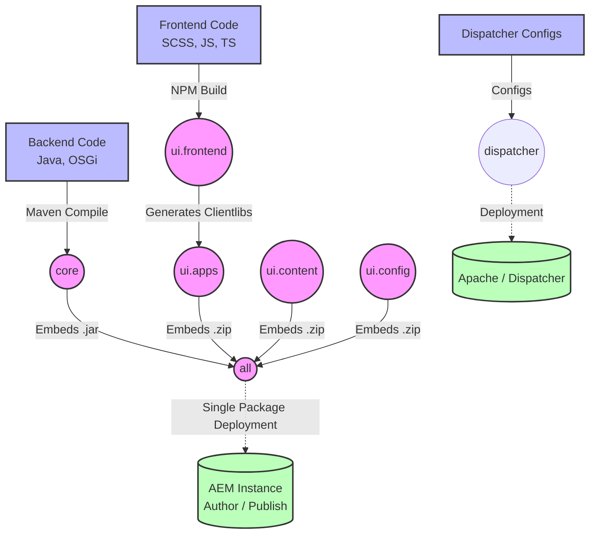

### Flow Explanation (Eppadi Work Aaguthu?):
1. **Frontend Flow:** Neenga `ui.frontend`-la eluthura styles & scripts compile aagi `ui.apps`-la clientlibs-a ulla pogum.
2. **Backend Flow:** `core`-la eluthura Java code compile aagi `.jar` file-a maarum.
3. **Packaging Flow:** `core`, `ui.apps`, `ui.content`, `ui.config` - Ithu nallum final-a compile aagi `all` module kulla package aagidum.
4. **Deployment:** Intha `all` package mattum thaan namma AEM server-la install aagum. Install aanathum, AEM automatically atha pirichu `/apps`, `/content`, `/conf` nu correct aana idathula place pannidum.
5. **Caching Flow:** `dispatcher` configurations thaniya Apache server-la deploy aagum to handle caching and security.


---

## Source: osgi_servlet_flow.md

# OSGi Servlet and Service Flow in AEM

This document explains how your `hellojava` servlet and `Hellojava` service work together within the AEM OSGi container.

## 1. The Components Involved

In your implementation, you have three distinct Java files. This structure follows the standard **Dependency Injection** pattern used in modern Java and AEM (via OSGi).

- **`Hellojava` (Interface)**: This is the blueprint. It simply defines *what* the service can do (e.g., `getMessage()`), without specifying *how* it does it.
- **`Hellojavaimpl` (Service Implementation)**: This is the actual worker. It provides the specific logic for the blueprint (e.g., returning `"This is my first service model"`). It is registered in AEM as an OSGi Service.
- **`hellojava` (Servlet)**: This is the entry point for the user's web browser. It listens for web requests, calls the service to get data, and sends the response back to the browser.

---

## 2. UML Class Diagram

This diagram shows the structural relationships between your classes.

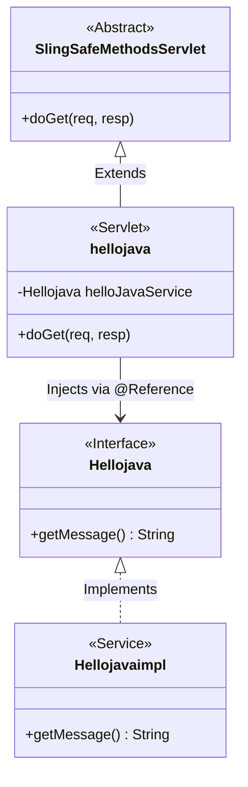

**Key Takeaways from UML:**
- The servlet `hellojava` **depends** on the interface `Hellojava`, *not* the implementation. This makes the code loosely coupled.
- OSGi Declarative Services automatically finds `Hellojavaimpl` (because it implements `Hellojava`) and injects it into the servlet.

---

## 3. Execution Flow Diagram

This sequence diagram illustrates exactly what happens when a user requests the `/bin/hellojava` URL in their browser.

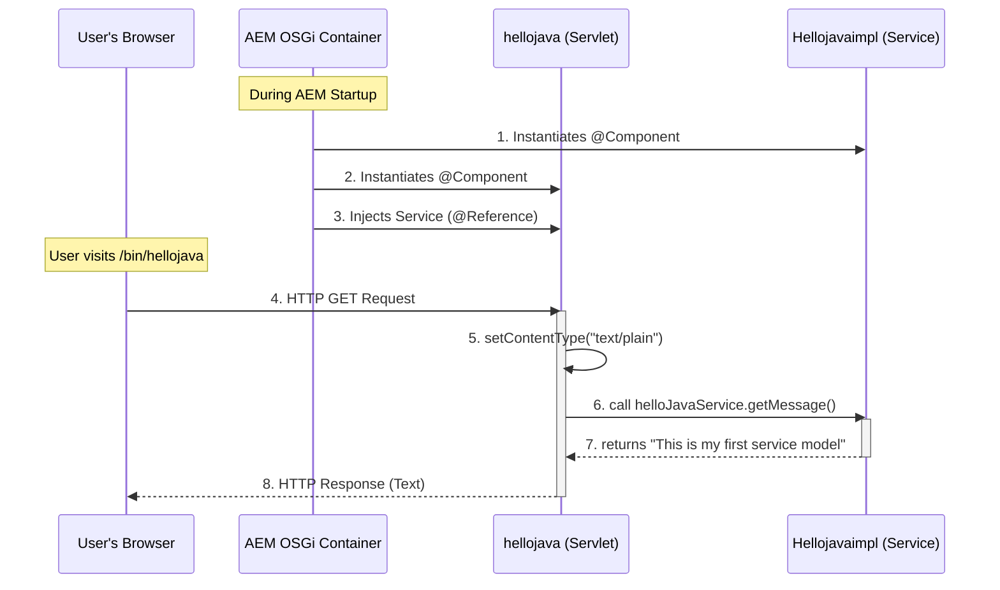

---

## 4. Step-by-Step Breakdown of the Flow

### Phase A: Wiring and Startup (Behind the Scenes)
When you build your code and deploy it to AEM, the OSGi framework kicks in:
1. **Component Scanning**: OSGi sees the `@Component` annotation on `Hellojavaimpl` and registers it in the system memory as a provider of the `Hellojava` service.
2. **Servlet Registration**: OSGi sees the `@Component` annotation on your `hellojava` servlet and registers it to listen to the path `/bin/hellojava`.
3. **Dependency Injection**: OSGi notices that your servlet has an `@Reference` to `Hellojava`. It wires them together by automatically supplying the `Hellojavaimpl` object into the servlet's memory.

### Phase B: Request Handling (When you visit the URL)
1. **The Trigger**: You open your browser and go to `http://localhost:4502/bin/hellojava`.
2. **Routing**: AEM sees the `/bin/hellojava` path and knows it belongs to your `hellojava` servlet. It triggers the `doGet` method.
3. **The Work**: 
   - The servlet sets the response type to standard text.
   - It calls `helloJavaService.getMessage()`.
   - The service implementation runs and returns the string.
4. **The Response**: The servlet takes that string and writes it directly to the HTTP response (`resp.getWriter().write(...)`), which is then sent across the network and displays on your screen.


---

## Source: aem_project_structure.md

# AEM Project Structure: Complete Folder & File Analysis (Tanglish)

Oru AEM (Adobe Experience Manager) Maven Archetype project-oda complete folder structure eppadi work aaguthu nu "top to bottom" (upside down) intha document-la detail-a analyze pannuvom. Ovvoru folder/file-oda logical purpose enna nu inga theliva pathidalam.

---

## 📂 1. `.cloudmanager`
- **Purpose:** AEM as a Cloud Service (AEMaaCS) la nammada project-a deploy panna use aagura configuration folder.
- **Inside it:** Ithu ulla cloud pipeline-kku thevayana environment variables matrum build configs irukkum. Cloud Manager eppadi namma code-a build panni server-la podanum nu ithu thaan decide pannum.

## 📂 2. `all`
- **Purpose:** Ithu oru "Aggregator" illana "Wrapper" module.
- **Inside it (`src/main/content/...`, `pom.xml`):** Intha folder ulla perusa entha code-um irukkathu. Ithoda main vela, matha ellam folders-ayum (`ui.apps`, `ui.content`, `core` etc.) onna serthu orey oru **ZIP / AEM Package** aaga aakurathu thaan. AEM-la deploy pannum pothu intha `all` package mattum thaan install aagum.

## 📂 3. `core`
- **Purpose:** Ithu thaan nammada **Backend Logic** folder (Java Code).
- **Inside it:**
  - `src/main/java/`: Inga thaan namma Java classes ezhuthuvom.
    - **Sling Models:** Frontend-kku (HTL) thevayana data-va JCR-la irunthu eduthu process panni kudukra classes.
    - **Servlets:** API calls handle pandrathukku (e.g., frontend-la irunthu form submit panna).
    - **OSGi Services:** Background jobs, API integration (like connecting to Salesforce/SAP).
  - `pom.xml`: Java dependencies (like GSON, Apache Commons) inga thaan add pannuvom.

## 📂 4. `dispatcher`
- **Purpose:** Ithu thaan nammada **Security & Caching layer** (Apache Web Server).
- **Inside it:**
  - `src/conf.d/`: Apache server configs (Virtual hosts, rewrites, redirects like HTTP to HTTPS).
  - `src/conf.dispatcher.d/`: AEM Dispatcher configs (Entha pages-a cache pannanum, entha cache-a invalidate pannanum, entha URLs-a block pannanum nu rules).

## 📂 5. `it.tests`
- **Purpose:** Backend Integration Testing.
- **Inside it:** Ithu Java based integration tests folder. Oru real AEM instance-la namma Java code eppadi run aaguthu nu test panna intha folder use aagum.

## 📂 6. `ui.apps`
- **Purpose:** Nammada **Frontend UI Components & HTL Scripts**. Ithu `/apps` folder kela deploy aagum.
- **Inside it (`src/main/content/jcr_root/apps/weekend/`):**
  - **components/**: Namma create pandra AEM components (e.g., custombanner, accordion, text). Ithulla thaan component `.content.xml`, `.html` (HTL script), matrum `_cq_dialog` irukkum.
  - **clientlibs/**: Namma component-kku thevayana CSS (styles) matrum JS (JavaScript) files-a AEM-kku puriyura format-la package pandra edam.

## 📂 7. `ui.apps.structure`
- **Purpose:** Structural definition for AEM.
- **Inside it:** Ithu `/apps/weekend` folder-oda basic skeleton (structure) create panni kudukkum. `ui.apps` deploy aagurathukku munnadi, AEM-la correct aana folder structure (like `/apps/sling/servlet/default`) irukka nu intha module ensure pannum.

## 📂 8. `ui.config`
- **Purpose:** **OSGi Configurations** (Environment specific settings).
- **Inside it (`src/main/content/jcr_root/apps/weekend/osgiconfig/`):**
  - Inga thaan namma environment-kku yetha mathiri configs ezhuthuvom.
  - e.g., `config.author` (Author environment mattum), `config.publish` (Publish env), `config.dev` (Development env). Backend Java services-kku thevayana API keys, timeouts ellam inga JSON/XML format-la save aagum.

## 📂 9. `ui.content`
- **Purpose:** **Default Content & Mutable Data**. Ithu `/content` matrum `/conf` folder kela deploy aagum.
- **Inside it (`src/main/content/jcr_root/`):**
  - **content/weekend/**: Default pages, test content, assets.
  - **conf/weekend/**: **Editable Templates**, Policies (Entha component entha page-la drag panna mudiyum nu rules), matrum Context Aware Configurations.

## 📂 10. `ui.frontend`
- **Purpose:** **Modern Frontend Build Mechanics** (Webpack/NPM).
- **Inside it:**
  - Inga thaan namma raw SCSS/SASS matrum TypeScript/React code ezhuthuvom.
  - `package.json` & `webpack.config.js`: Ithu NPM build files. Code-a compile panni, minify panni, output-a `ui.apps`-oda clientlibs folder-kku anuppidum. Appuram AEM atha use pannikkum.

## 📂 11. `ui.tests`
- **Purpose:** UI Automation Testing.
- **Inside it:** Cypress, Selenium, illana WebdriverIO use panni ezhutha patta automated UI tests. Ithu frontend workflows (like filling a form, clicking a button) correct-a work aagutha nu test pannum.

---

## 📄 Root Files Analysis (The Files Upside Down)

### 12. `.gitattributes` & `.gitignore`
- `.gitattributes`: Git-kku line endings (Windows vs Mac/Linux) eppadi handle pannanum nu solrathu.
- `.gitignore`: Entha files-a Git-la commit panna koodathu nu list pandrathu (e.g., `target/`, `node_modules/`, `.idea/`).

### 13. `LICENSE` & `README.md`
- `LICENSE`: Project-oda legal usage rights.
- `README.md`: Project-oda instructions, eppadi build pannanum (`mvn clean install`), enna version required nu developer-kku documentation kudukkum.

### 14. `archetype.properties`
- Ithu namma AEM Maven Archetype create pannum pothu kudutha input parameters-a (like `appId=weekend`, `package=com.weekend`, `aemVersion=cloud`) store panni vekkum. Future updates-kku ithu use aagum.

### 15. `pom.xml` (The Master File)
- **Purpose:** The Heart of the Project.
- **Why is it here?** Ithu thaan "Parent POM". Namma project-oda total dependency versions, plugins, matrum sub-modules (`core`, `ui.apps`, etc.) ellathayum control pandrathu ithu thaan.
- **Logic:** `mvn clean install` command prompt-la run pannum pothu, maven first intha `pom.xml` a thaan padikkum. Ithu ulla irukka `<modules>` section-a pathu thaan matha ellam folder-ayum (from `core` to `all`) varisaiya build pannum.

---
**Summary Flow:**
`ui.frontend` (Raw CSS/JS) --> `ui.apps` (Components/HTL) --> `core` (Java) --> `ui.config` (OSGi Settings) --> `ui.content` (Pages/Templates) --> **Everything packed inside `all`** --> Deployed to AEM!


---

## Source: clientlibs_explanation.md

# AEM `clientlibs` Folder Detailed Explanation (Tanglish)

AEM-la `clientlibs` (Client Libraries) apdingrathu oru romba romba mukkiyamana concept. Oru website-kku thevayana **CSS (Design/Styles), JS (JavaScript/Logic), matrum Fonts** ellathayum manage pandra idathukku peru thaan `clientlibs`.

Normal HTML website-la namma `<link href="style.css">` nu ovvoru file-a add pannuvom. Aana AEM-la apdi panna koodathu. Athukku bathila ellathayum Clientlibs aaga package panni thaan AEM-kku anuppuvom. Ithu page-oda speed-a increase pannum (Minification & Concatenation).

Unga project-la irukka `apps/weekend/clientlibs` folder ulla irukka 4 main sub-folders enna enna nu theliva papom:

---

## 🗂️ 1. `clientlib-dependencies`
- **Purpose:** 3rd Party Libraries (Veliya irunthu vaanguna code).
- **Explanation:** Unga project-kku jQuery, Bootstrap, Slick Slider, illana vere ethavathu veli JS/CSS library theva na, athu ellam inga thaan varum. 
- **Logic:** Ithu thaan "Foundation". Unga custom code load aagurathukku munnadi intha dependencies muthalla load aagi irukkanum.

## 🗂️ 2. `clientlib-base`
- **Purpose:** Core Styling & Variables.
- **Explanation:** Ithu unga website-oda adippadai (Base) styles.
  - CSS Reset (Browser default styles-a remove pandrathu)
  - Fonts & Typography rules (Entha font use pannanum)
  - Global CSS variables (Colors, Spacing, Breakpoints) ellam inga thaan irukkum.
- **Logic:** Enthe component-a irunthalum intha base rules-a thaan mathikka venum.

## 🗂️ 3. `clientlib-grid`
- **Purpose:** AEM Responsive Grid System.
- **Explanation:** AEM-la "Layout Container" nu oru concept irukku. Author oru component-a screen-la resize panna (e.g., Mobile-la full width, Desktop-la half width) intha grid system thevai.
- **Logic:** 12-column grid layout-kku thevayana CSS (width, floats, flexbox rules) ellam intha folder-la thaan irukkum. Ithu AEM page authoring properly align aaga help pannum.

## 🗂️ 4. `clientlib-site`
- **Purpose:** Nammada Custom Code (Site-specific).
- **Explanation:** Ithu thaan main hero! Neenga HTML/CSS frontend developer aaga ezhuthura majority of the custom code inga thaan final aaga vanthu ukkarum.
- **Logic:** Header, Footer, Custom Banner, Accordion, matrum unga site-oda overall look & feel-kku thevayana ellam custom CSS matrum JavaScript intha `clientlib-site` kulla thaan bundle aagum. Usually, Frontend Webpack build panna piragu antha output inga thaan auto-deploy aagum.

---

## ⚙️ Ithu Eppadi Work Aaguthu? (Internal Mechanics)

Ovvoru `clientlib-*` folder kullayum 3 mukkiyamana items irukkum:

1. **`.content.xml`**: Ithu thaan config file. Ithula `categories="[weekend.site]"` nu peru vechirupanga. Mela patha `clientlib-dependencies` a ithukulla `dependencies="[weekend.dependencies]"` nu connect pannikuvanga.
2. **`css.txt`**: Intha folder ulla entha entha CSS files irukko, athoda names ellam intha text file-la varisaiya list panni iruppanga. (E.g., `base.css`, `header.css`).
3. **`js.txt`**: Athe mathiri entha entha JS files bundle aaganum nu intha text file-la list panniyirukkum.

### Output:
AEM website load aagum pothu, HTL file-la `<sly data-sly-use.clientlib="/libs/granite/sightly/templates/clientlib.html" data-sly-call="${clientlib.all @ categories='weekend.site'}"/>` nu oru orey oru line kodupeenga. AEM automatic-a intha 4 folders-layum irukka code-a onna merge panni, compress panni, single `.css` matrum single `.js` file aaga user browser-kku anuppidum!


---

## Source: components_overview.md

# AEM Components Detailed Overview (Tanglish)

Unga project-la irukka ellam components-oda use cases, output, matrum avai eppadi verupaduthu nu category-wise ah theliva explain panniruken.

---

## 📝 1. Basic Content Components
Ithu website-oda basic building blocks (text, images, links).

### `text`
- **Where to use:** Page-la paragraphs, descriptions, or articles add panna use pannuvom. Rich text editor (RTE) support irukkum (Bold, Italic, Links).
- **Output:** HTML `<p>`, `<h1>` to `<h6>`, or `<ul>` tags-a render pannum.
- **How it differs:** Ithu static content mattum thaan kaattum. Dynamic data-kku `title` or `list` poganum.

### `title`
- **Where to use:** Page illana section-kku heading kudukka. SEO-kku romba mukkiyam.
- **Output:** `<h1>` irunthu `<h6>` varaikum aana HTML tags.
- **How it differs:** Ithu page-oda properties-la irunthu automatic-a title-a eduthu kaatta mudiyum. `text` component-la antha automation kidayathu.

### `image` & `customimage`
- **Where to use:** Website-la photos, logos, banners kaatta use pannuvom.
- **Output:** HTML `` tag with `src`, `alt`, and `title` attributes.
- **How it differs:** `customimage` unga project-kaga custom-a modify panna pattathu (e.g., extra styling or tracking fields). `image` vanthu default core component.

### `button`
- **Where to use:** Call to action (CTA) links-kku use pannuvom (e.g., "Click Here", "Submit").
- **Output:** Oru clickable `<button>` illana `<a>` tag with button CSS class.
- **How it differs:** `text` component-la link add pannalam, aana ithu specific aaga button UI design-kaga mattum use aaguthu.

### `separator`
- **Where to use:** Rendu content section-kku naduvula oru kodu (line) varanja mathiri kaatta.
- **Output:** `<hr>` (Horizontal Rule) tag.
- **How it differs:** Ithu entha content-um illatha oru pure visual styling component.

### `download` & `pdfviewer`
- **Where to use:** Users-a PDF, DOCX file-a download panna vekka (`download`) illana page-laye antha PDF-a open panni padikka vekka (`pdfviewer`).
- **Output:** `download` oru file link-a tharum. `pdfviewer` oru embedded iframe/viewer-a tharum.
- **How it differs:** Rendum assets-kaga thaan. Aana onnu user system-la save aagum, innonnu browser-laye display aagum.

### `helloworld`
- **Where to use:** AEM developers code eppadi work aaguthu nu test panna use pandra oru dummy/training component.
- **Output:** "Hello World Component" nu oru text matrum backend Java model data.
- **How it differs:** Ithu production website-la end-user kku use aagathu. Just for development reference.

---

## 🗂️ 2. Container & Layout Components
Content-a group panni azhaga align panna use aagum.

### `container`
- **Where to use:** Multiple components-a (e.g., Oru Image, keela Text, keela Button) onna group panni oru box kulla vekka.
- **Output:** Oru `<div>` tag with specific background/layout settings.
- **How it differs:** Ithu basic box. Ithukkulla verum vertical/horizontal alignment thaan panna mudiyum.

### `carousel`
- **Where to use:** Sliding images illana sliding cards (Hero Banners) kaatta.
- **Output:** Oru interactive slider UI with next/prev buttons.
- **How it differs:** `container` la ellam onna screen-la theriyum. Ithula ovvonna slide aagi theriyum.

### `accordion`
- **Where to use:** FAQs (Frequently Asked Questions) section-kku. Click panna expand aagi content theriyum.
- **Output:** Collapsible panels (HTML `<details>` or custom JS logic).
- **How it differs:** Space-a save pannum. User click panna mattum thaan content expand aagi theriyum.

### `tabs`
- **Where to use:** Orey idathula multiple content-a tabbed views-la kaatta (e.g., Tab 1: Overview, Tab 2: Specs, Tab 3: Reviews).
- **Output:** Horizontal or vertical clickable tabs structure.
- **How it differs:** `accordion` vertical-a expand aagum. `tabs` generally horizontal view-kku use aagum.

---

## 🗺️ 3. Navigation Components
User website-kulla suthi paakka vazhikaattum.

### `navigation`
- **Where to use:** Website-oda Header (Main Menu) la use pannuvom.
- **Output:** `<ul>` and `<li>` tags with hierarchical page links.
- **How it differs:** Ithu website-oda top-level pages-a automatically fetch panni kaattum.

### `breadcrumb`
- **Where to use:** User ippo website-la entha idathula irukanga nu kaatta (e.g., `Home > Electronics > Mobiles`).
- **Output:** Oru trail of links.
- **How it differs:** `navigation` ellam vazhiyum kaattum. `breadcrumb` user vantha specific root path-a mattum kaattum.

### `languagenavigation`
- **Where to use:** Multi-lingual sites-la (e.g., English to Tamil switch panna) dropdown menu-vaga use aagum.
- **Output:** Language switch links.
- **How it differs:** Ithu pages-kku illama, AEM-oda language copies-a identify panni map pannum.

### `tableofcontents`
- **Where to use:** Oru periya blog/article page-la, ulla irukka main headings-a list panna.
- **Output:** Page-la irukka `<h1>`, `<h2>` tags-a scan panni oru index list-a tharum.
- **How it differs:** Ithu entha puthu content-um create pannathu, existing text-a vachu navigation generate pannum.

---

## ⚙️ 4. Dynamic & Advanced Components

### `teaser`
- **Where to use:** Oru page-oda preview-va innoru page-la kaatta (e.g., Home page-la irukka article preview card).
- **Output:** Image, Title, short Description matrum oru "Read More" button.
- **How it differs:** Ithu link panna page-la irunthu image/text-a automatic-a eduthu kaattum.

### `list`
- **Where to use:** Latest News, Top Articles mathiri multiple pages-a list panna.
- **Output:** Oru list of links with dates or summaries.
- **How it differs:** `navigation` structure-a kaattum. `list` namakku thevayana specific pages-a mattum query (search) panni kaattum.

### `search`
- **Where to use:** Website-la search bar vachi content theda.
- **Output:** Oru input box matrum AEM JCR-la search panni varum results list.
- **How it differs:** Ithu dynamic. User type panna panna data fetch aagi varum.

### `form` (Folder)
- **Where to use:** Contact Us, Registration mathiri user input vanga.
- **Output:** HTML `<form>`, `<input>`, `<select>` tags.
- **How it differs:** Matha components ellam data kaattum. Ithu user kitta irunthu data vangum.

### `embed`
- **Where to use:** YouTube video, Twitter feed, Google Maps mathiri 3rd party content-a website-la ulla konduvara.
- **Output:** Custom HTML/Iframe.
- **How it differs:** Ithu AEM-la irukka content-a kaattathu. Veliya irukka internet data-va embed pannum.

---

## 🧩 5. Headless & Fragment Components
Content-a oru thadava ezhuthitu neraya idathula use panna ithu thevai.

### `experiencefragment`
- **Where to use:** Header, Footer mathiri layout+content-a global aaga use panna.
- **Output:** Entha fragment-a link pandromo, athoda full UI-a inga render pannidum.
- **How it differs:** Oru page-la mathina ellam page-layum automatic-a update aagidum.

### `contentfragment` & `contentfragmentlist`
- **Where to use:** Pure raw data-va (e.g., Recipe, Author bio) design illama data-va mattum reuse panna.
- **Output:** JSON format-la irukka data-va UI-la HTML aaga render pannum.
- **How it differs:** `experiencefragment` la layout/design irukkum. `contentfragment` la verum text data mattum thaan irukkum.

---

## 🌐 6. Page & SPA (Single Page Application) Components

### `page` & `xfpage`
- **Where to use:** Oru website-oda base root structure. Matha ellam components-um ithukkulla thaan varum.
- **Output:** Full `<html>`, `<head>`, matrum `<body>` tags.
- **How it differs:** `xfpage` specifically Experience Fragments-kaga create panna patta mini-page structure.

### `spa`
- **Where to use:** React illana Angular vachu AEM-la Single Page App ezhuthum pothu base aaga use aagum.
- **Output:** JSON model data-va frontend frameworks-kku expose pannum.

### `remotepage` & `remotepagenext`
- **Where to use:** AEM illatha external frontend apps (Next.js) kooda AEM-a connect panna use pandra puthu feature.
- **Output:** Headless delivery. Component UI-a AEM render pannathu, external app thaan render pannum.

---
**Conclusion:** AEM-la ovvoru component-um "Lego Blocks" mathiri. Unga requirement (Image, Text, Form, Layout) ennavo, athukku yetha correct block-a eduthu use pannum pothu website fast aagavum, neat aagavum work aagum!


---

## Source: component_creation_conditions.md

# Conditions for Creating AEM Components: Proxy vs Custom (Tanglish)

AEM-la oru component create pannum pothu, athu **Proxy Component** aaga irukkalaam illana **Custom Component** aaga irukkalaam. Rendu type-kkum enna enna conditions matrum rules follow pannanum nu inga theliva papom.

---

## 🏗️ 1. Proxy Component (Inheriting from Core Components)

Proxy component na AEM-oda default Core Components-a (e.g., Image, Text, Title) inherit panni nammada project-kku yetha mathiri use pandrathu. Ithu thaan Adobe recommend pandra **Best Practice**.

### 📌 Conditions to Know:
1. **Mandatory Rule (`sling:resourceSuperType`):** 
   Unga component-oda `.content.xml` file-la kandippa `sling:resourceSuperType` property irukkanum. Ithula Core component-oda path-a kudukkanum (e.g., `core/wcm/components/image/v3/image`). Ithu illana inherit aagathu.
   
2. **Do Not Duplicate Code (DRY Principle):**
   Core component-a inherit pannum pothu, unga folder-la HTML (`.html`) matrum Dialog (`_cq_dialog`) files-a **create panna thevai illa**. AEM automatic-a core component files-a use pannikkum. 
   *(Exception: Neenga HTML layout-a mathanum illana pudhusa dialog field add pannanum na mattum override pannalam).*

3. **Backend Logic is Free (Sling Models):**
   Java backend (Sling Models) ezhutha thevai illa. Core component-oda Java class automatic-a unga component-kku connect aagidum.

4. **When to use?**
   Oru basic aana Image, Text, List, Carousel, illana Teaser thevai na, pudhusa create pannama always Proxy component-a thaan use pannanum.

---

## 🛠️ 2. Custom Component (Building from Scratch)

Custom component na AEM-la default-a illatha oru puthu feature-a (e.g., "Live Stock Price Ticker" or "Custom API Form") scratch-la irunthu namma uruvakkurathu.

### 📌 Conditions to Know:
1. **Requires Full Structure:**
   Ithukku neenga kandippa 3 items-um create panniye aaganum:
   - Component ID card (`.content.xml`)
   - Frontend layout (`<component_name>.html`)
   - Author Input Form (`_cq_dialog` folder)

2. **Custom Backend (Java Sling Model):**
   Custom component-la complex logic irukkum. So, data-va process panna, API-a call panna kandippa oru puthu **Java Sling Model** create pannanum. Atha HTL-la `data-sly-use.model="..."` nu connect pannanum.

3. **CSS Standard (BEM Methodology):**
   HTML ezhuthum pothu `cmp-<component-name>` apdingra BEM (Block Element Modifier) CSS standards-a follow pannanum. Ithu AEM-la design break aagama pathukkum.

4. **Proper Component Grouping:**
   `.content.xml` file-la `componentGroup` property-a theliva kudukkanum (e.g., `Weekend Project - Custom`). Appo thaan AEM UI-la authors-kku theduthal easy-a irukkum.

5. **When to use?**
   Core components vachu entha vithathilum unga requirement-a achieve panna mudiyatha patchathil mattum thaan Custom component create pannanum. AEM rules padi, "Re-inventing the wheel" (irukkratha thirumba create pandrathu) avoid pannanum.

---

### 💡 Quick Summary
> [!TIP]
> **Proxy Component** = Minimal Effort + Uses AEM's built-in power. (Use for 90% of basic UI elements).
> 
> **Custom Component** = Maximum Effort + Full Control. (Use for 10% of unique business logic elements).


---

## Source: explain.md

# AEM Component Structure: Detailed Logical Explanation (Tanglish)

AEM (Adobe Experience Manager) la oru component epdi work aaguthu, athoda structure enna, ovvoru file matrum folder oda logical purpose enna nu inga detail-a papom.

## Component Data Flow & Structure (UML/Flow Diagram)

Oru component-oda file structure matrum data epdi flow aaguthu nu purinjikka intha diagram-a parunga:

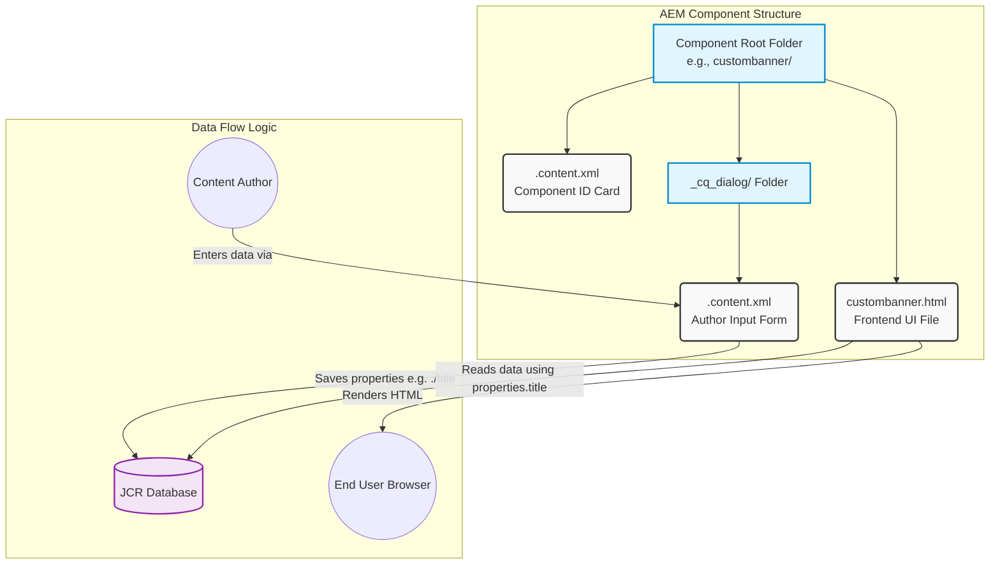

---

## Folder & File Purpose (Logic & Reason)

Oru AEM component create pannum pothu namma uruvakkura ovvoru file-kum oru specific aana reason irukku. Athellam logical-a inga explain panniruken.

### 1. Component Root Folder (e.g., `custombanner/`)
- **Why is it used?** AEM-la component oru self-contained module mathiri. Oru component-kku thevayana ellathayum ore idathula vachirukanum.
- **Purpose:** Ithu HTML, Dialog configs, matrum scripts ellathayum onna group panni vekkum oru container folder. Ithu illana AEM-kku ethu entha component oda file nu theriyaama poidum.

### 2. Component `.content.xml` (`custombanner/.content.xml`)
- **Why is it used?** AEM engine-kku "Ithu oru component" nu identify panna intha file thevai.
- **Purpose:** Ithu thaan component-oda **"ID Card"**. Intha file-la thaan component peru (`jcr:title`), description, matrum author menu-la entha category/group (`componentGroup`) kela intha component varanum nu define pannuvom. Ithu illana author-nala component-a drag & drop panna mudiyathu.

### 3. HTL / HTML File (`custombanner.html`)
- **Why is it used?** Browser-la end-user kku component epdi theriyanum (UI layout) nu define pandrathuku.
- **Purpose:** Ithu thaan namma **Frontend Rendering File**. AEM-la HTL (HTML Template Language) use pannuvom. Author kudukra data-va backend (JCR database) la irunthu eduthu UI-la kaatta ithu use aaguthu (Example-kku, `${properties.title}`). Ithu illana website-la component visible aagathu.

### 4. `_cq_dialog` Folder
- **Why is it used?** Oru component-kku property/authoring form irukku nu AEM system-kku solrathukku.
- **Purpose:** Ithu **Authoring-kaga mattum** use aagum oru specific folder. End-user website-a paakum pothu intha folder theva illa. Ithu author input vanga thevayana configuration files-a store panna oru container aaga work aaguthu.

### 5. Dialog `.content.xml` (`_cq_dialog/.content.xml`)
- **Why is it used?** Dialog ulla enna fields varanum (e.g., text box, dropdown, image picker) nu define pandrathukku.
- **Purpose:** Ithu thaan **Author Input Form**. AEM author component-a edit pannum pothu open aagura pop-up window-va intha file thaan define pannuthu. Inga author enter pandra data thaan JCR database-la properties-a save aagum (Example: `name="./title"` nu kudutha, database la `title` nu save aagum).

---

## Logical Data Flow Summary (Epdi Data Flow aaguthu?)

Oru logic-a yosichu patha, AEM component intha 3 steps-la thaan work aaguthu:

1. **Input Phase (Data vangarathu):** Author AEM page-a edit panni, component-oda dialog open pandranga. Namma ezhuthuna `_cq_dialog/.content.xml` file thaan antha dialog form-a screen-la render pannuthu.
2. **Save Phase (Data save aagrathu):** Author text box-la data (e.g., "Welcome to WKND") adichu tick/save button press pannum pothu, AEM antha data-va behind the scenes-la **JCR Database**-la save pannidum.
3. **Output/Render Phase (Data kaatrathu):** End-user (normal visitor) antha website page-a load pannum pothu, AEM antha component-oda `custombanner.html` file-a run pannum. Antha HTML file JCR database-la save aagrukka data-va eduthu, browser-kku azhagana UI-a kondu poi sekkum.

Ithu thaan AEM component-oda complete life cycle matrum logical structure!


---

## Source: uiapps_analysis.md

# `ui.apps` Folder - Detailed Analysis (Tanglish)

AEM project-la romba mukkiyamana folder intha `ui.apps` thaan. Namma ezhuthura majority of the frontend component code inga thaan irukkum. Ithu eppadi work aaguthu, ithukulla enna enna irukku nu intha document-la detail-a papom.

---

## 🏗️ `ui.apps` oda Main Purpose Enna?
Oru website-la theriyura components (e.g., Header, Footer, Banner, Text) ellathukkum oru HTML structure thevai. Antha HTML script (HTL format), AEM component-oda Authoring dialog forms, matrum CSS/JS files ellathayum AEM server-oda `/apps` folder-kku anuppura vela thaan intha `ui.apps` module-oda muthal kadamai.

> [!NOTE] 
> **AEM Path Mapping:** Neenga `ui.apps/src/main/content/jcr_root/apps/weekend/` la podura ellam files-um, AEM-la deploy aagum pothu exact-a `/apps/weekend/` kela map aagidum.

---

## 📂 Internal Structure & Folders Explanation

`ui.apps` kulla main-a intha structure thaan follow pannuvom: 
`src/main/content/jcr_root/apps/weekend/` 
Ithukkulla irukka 3 main sub-folders pathi theliva papom:

### 1. `components` Folder
- **Path:** `apps/weekend/components/`
- **What is it?** Ithu thaan component factory! Neenga pudhusa entha component create pannalum (e.g., `accordion`, `breadcrumb`, `carousel`) athu inga thaan varum.
- **Inside each component folder:**
  - **`component-name.html` (HTL File):** Ithu frontend layout. JCR database-la irunthu data-va eduthu HTML-a render pannum (e.g., `${properties.text}`).
  - **`.content.xml`:** Component-oda properties (Name, Group, Description) define pandra file.
  - **`_cq_dialog/`:** Author content add pandrathukku thevayana input form (Text fields, Image uploaders).
- **Logical Flow:** Component HTML file illana antha component website-la theriyathu. Dialog illana author-nala data enter panna mudiyathu.

### 2. `clientlibs` Folder (Client Libraries)
- **Path:** `apps/weekend/clientlibs/`
- **What is it?** Nammada CSS (styles) matrum JS (JavaScript) files-a AEM handle pandra oru special system thaan `clientlibs`.
- **Purpose:** AEM-la namma direct-a `<link href="style.css">` nu kodukka mattom. Athukku bathila ellam CSS/JS-um `clientlib` aaga package pannuvom.
- **How it works?** Oru `.content.xml` file-la `categories="[weekend.site]"` nu define pannuvom. AEM frontend-la antha category-a call pannum pothu, athukkulla irukka ellam JS/CSS files-um onna minify aagi (bundle aagi) browser-kku varum. Ithu page load speed-a increase pannum.

### 3. `i18n` Folder (Internationalization)
- **Path:** `apps/weekend/i18n/`
- **What is it?** Unga website multi-language (English, Tamil, French) support pandrathu na, intha folder thevai.
- **Purpose:** Static text (e.g., "Read More", "Submit Button") ellathayum hardcode panna koodathu. Athukku bathila HTL-la `${'Read More' @ i18n}` nu poduvom. Intha `i18n` folder-la irukka translation dictionaries (JSON or XML), user entha language site paakuraro athukku yetha mathiri text-a translate panni kudukkum.

---

## 📄 Important Files inside `ui.apps`

### 4. `pom.xml` (Maven Config file for ui.apps)
- **Purpose:** Intha folder-a oru ZIP file-a convert panna thevayana instructions inga thaan irukku.
- **How it works:** Ithu `filevault-package-maven-plugin` nu oru tool use panni, `ui.apps` ulla irukka ellam folders-ayum `.zip` (AEM Package format) aaga pack panniidum. Oru vaati pack aanathum, AEM Package Manager-la ithu automatic-a install aagum.

### 5. `META-INF/vault/filter.xml`
- **Path:** `src/main/content/META-INF/vault/filter.xml`
- **Purpose:** Ithu oru strict security guard mathiri!
- **Logic:** Entha folders AEM-kku ulla poganum nu intha file thaan mudivu pannum. For example, ithula `<filter root="/apps/weekend"/>` nu illana, neenga enna code ezhuthunalum athu AEM-kku pogathu.

### 6. `target` Folder
- **Purpose:** Ithu nammala create panna padathu. Namma terminal-la `mvn clean install` run pannum pothu, Maven automatic-a intha folder-a create panni, athukkulla build aana final ZIP file-a (e.g., `weekend.ui.apps-1.0.0-SNAPSHOT.zip`) vekkum. `clean` kudutha intha folder azhinjidum.

---

## 🔄 Quick Flow Summary for `ui.apps`
1. Developer HTL (`.html`) matrum Dialogs ezhuthuranga **(`components`)**.
2. Frontend dev CSS/JS files poduranga **(`clientlibs`)**.
3. `mvn clean install` run pandrom.
4. Maven `filter.xml` rules vachu `ui.apps` a oru ZIP package-a aaki **`target`** folder-la vaikuthu.
5. Antha ZIP AEM-kku anuppa pattu `/apps/weekend` path-la extract aaguthu!


---

## Source: osgi_explanation.md

# OSGi in AEM: Complete Guide (Tanglish)

## 1. OSGi Na Enna? Yethukku Ithu Thevai? (Why do we need OSGi?)

Normally namma Java-la oru project panna, ellathayum compile panni oru periya `.war` or `.jar` file-a deploy pannuvom. Oru chinnatha change panna kooda, whole server-a restart pannanum. Ithu oru "Monolithic" approach.

**OSGi (Open Services Gateway initiative)** vanthu intha problem-a solve pannuthu. Itha oru **"Dynamic Module System"** nu solluvanga.

> [!NOTE]
> **Real-life Analogy:**
> - **Normal Java Project:** Oru Laptop mathiri. Ram-a maathanum na, laptop-a off panni, kalatti thaan maathanum.
> - **OSGi Project:** Oru Desktop PC mathiri. PC run aagitu irukkum pothe, USB mouse-a plug panna work aagum, remove panna stop aagum (Plug and Play). AEM-la OSGi athe vela thaan pannuthu. Namma server run aagitu irukkum pothe, code-a update pannalam, start/stop pannalam.

### OSGi-yoda 3 Main Pillars:
1. **Bundles (Modularity):** Unga java project-a chinna chinna pieces-a aakkidalam. Oru bundle-a update panna, matha bundles affect aagathu.
2. **Services (Decoupling):** Oru class-kku innoru class thevai na, direct-a `new` keyword use panni object create panna matom. Pathilaga, OSGi Service Registry-la irunthu keppom.
3. **Configurations:** Code-la values-a hardcode pannama (e.g., API url), UI valiyaga values pass pannalam.

---

## 2. OSGi Architecture & Flow Diagram

Yenna nadakkuthu inside OSGi? Oru simple flow diagram moolama purinjikalam. Imagine neenga oru frontend component-kku data anuppa oru Servlet eluthuringa. Antha Servlet oru Service-a call pannuthu.

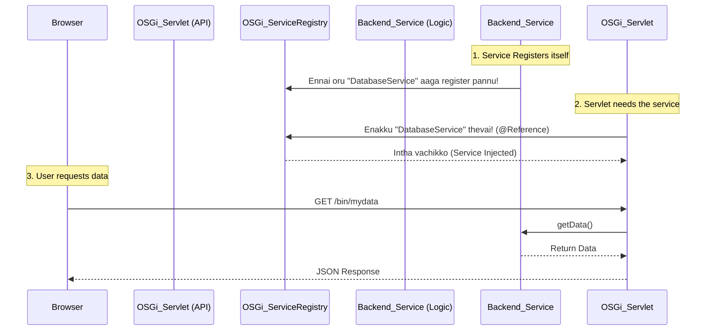

**Step-by-Step Logic in above flow:**
1. **Registration:** `Backend_Service` athula irukka `@Component` annotation moolama thannaiye register pannikuthu. Ithu server start aagum pothe nadanthurum.
2. **Referencing:** Servlet-kku antha service thevai. Athu `@Reference` potu OSGi-kitta kekkum. OSGi automatically antha service-a inga "Inject" pannidum. Ithanala intha rendu class-um tight-a attach aagi illa (Loose coupling).
3. **Execution:** User request pannumpothu, Servlet antha service-a call panni output-a browser-kku tharum.

---

## 3. How to implement OSGi in your Project? (Use Cases)

Unga project (`c:\Users\Project1\weekend`) la 3 main vithama OSGi use pannuvom.

### Type 1: OSGi Service (Business Logic)
Oru specific task-a (like 3rd party API call, complex calculation, database query) panna ithu thevai.

**Why use this step?** Code reusability-kku thaan. Oru service ezhuthitta, atha Servlet, Sling Model, illana innoru Service-la enga venalum call pannalam.

```java
// File: core/src/main/java/com/weekend/core/services/MyApiService.java

import org.osgi.service.component.annotations.Activate;
import org.osgi.service.component.annotations.Component;

// 1. @Component ithai oru OSGi component aakkuthu
@Component(service = MyApiService.class, immediate = true)
public class MyApiServiceImpl implements MyApiService {
    
    // 2. @Activate run aagum pothu intha service start aagum
    @Activate
    protected void activate() {
        System.out.println("Service Started! Setup ready.");
    }

    // 3. Ithu namma business logic
    public String fetchData() {
        return "Data from API";
    }
}
```
> [!IMPORTANT]
> *What happens here:* `immediate=true` nu potta, server start aagum pothe (allathu bundle install aanavudane) intha component activate aagidum. AEM OSGi Container intha class-kku oru object create panni Service Registry-la add pannidum.

### Type 2: OSGi Configuration (Dynamic Settings)
Unga project-la current-a open panni vachirukka `SimpleScheduledTask.java` file ithukku nalla example. 

**Why use this step?** Oru API url-o illa timeout value-o code-la ezhuthita, atha matha marubadiyum code change panni deploy pannanum. Aana OSGi Config use panna, AEM Web Console (`/system/console/configMgr`) la poyi UI-la text box-la value mathittu save pannalam. Code automatic-a puthu value eduthukkum.

```java
import org.osgi.service.metatype.annotations.AttributeDefinition;
import org.osgi.service.metatype.annotations.ObjectClassDefinition;
import org.osgi.service.component.annotations.Component;
import org.osgi.service.component.annotations.Modified;
import org.osgi.service.metatype.annotations.Designate;

// 1. Configuration structure define panrom
@ObjectClassDefinition(name="My Configuration")
public @interface MyConfig {
    @AttributeDefinition(name = "API URL")
    String apiUrl() default "https://api.example.com";
}

// 2. Main component
@Component(service=Runnable.class)
@Designate(ocd=MyConfig.class) // 3. Link config to component
public class MyComponent {
    private String url;

    // 4. @Modified call aagum eppo na, user config UI-la value mathumpothu!
    @Modified
    @Activate
    protected void activate(MyConfig config) {
        this.url = config.apiUrl(); // Read value from config
    }
}
```
> [!TIP]
> *What happens here:* AEM start aagum pothe (`@Activate`), Config-la irukka default value-a eduthu `url` variable-la save pannidum. User AEM config manager UI-la value mathuna udane, AEM automatic-a `@Modified` method-a call panni puthu value-a update pannidum. Code restart thevai illa!

### Type 3: OSGi Schedulers / Event Listeners
AEM-la background jobs run panna.

**Why use this step?** Daily night 12 manikku oru database cleanup job run aaganum na, atha namma manual-a panna mudiyathu. Itha automate panna OSGi schedulers thevai. Neenga open panni irukka `SimpleScheduledTask.java` file kulla parunga, anga `@Component(service=Runnable.class)` irukkum, and config-la `cron-expression` irukkum. Antha cron time-kku, andha class-oda `run()` method-a OSGi trigger pannidum.

---

## 4. Summary: Yen OSGi suthama puriyala nu thonuthu?

Normal Java-la namma flow-a namma control pannuvom. `main()` method-la aarambichi namma call panra method run aagum.
Aana OSGi oru **"Inversion of Control (IoC)"** framework. Athavathu, OSGi container thaan king. 
Neenga just class ezhuthi, athula `@Component`, `@Reference` nu stickers (annotations) otti vachiduvinga.
AEM start aagumpothu, OSGi andha stickers-a paarthu, entha class-a first create pannanum, entha class-a entha class kulla anuppanum (dependency injection) nu athuve mudivu panni ellathayum connect pannidum.

> [!WARNING]
> **Golden Rule of OSGi:**
> Neenga oru Java class create panringa, atha AEM backend-la run aaganum or matha classes use pannanum na... athula kandyppa `@Component` annotation irukkanum! Appo thaan OSGi-kku unga class irukkune theriyum.

